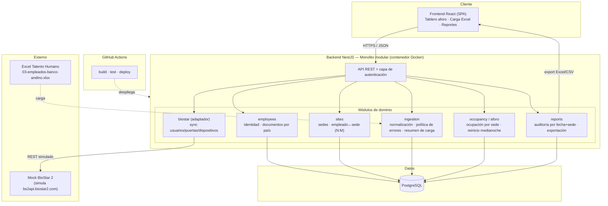

# Plan de Arquitectura — Sistema de control de acceso Banco Andino

> Este documento está pensado para que Marcela pueda **sustentar la decisión ante un comité**: no solo dice qué se eligió, sino **qué se descartó y por qué**. Fernando fue explícito: *"que ellos nos indiquen qué recomiendan y por qué. Y también qué descartaron, porque eso es lo que uno nunca conoce."*

---

## 1. Resumen de la decisión

| Componente | Decisión | Carácter |
|---|---|---|
| Estilo arquitectónico | **Monolito modular** | Elegido (justificado) |
| Backend | **NestJS (TypeScript)** | Elegido (libre, justificado) |
| Base de datos | **PostgreSQL** | Impuesto (no negociable) |
| Frontend | **React** | Impuesto (no negociable) |
| CI/CD | **GitHub Actions** | Impuesto (no negociable) |
| Empaquetado | **Docker / docker-compose** | Requisito del cliente |
| Integración BioStar | **Módulo con adaptador + mock** | Simulada (no hay ambiente) |

La idea de fondo: **una sola aplicación desplegable, internamente dividida en módulos con fronteras claras**, sobre un stack de un único lenguaje (TypeScript de punta a punta) para maximizar mantenibilidad por parte del equipo interno.

---

## 2. Estilo arquitectónico: monolito modular

### Qué es

Una única aplicación backend desplegable, organizada internamente en **módulos con responsabilidades y fronteras explícitas** (empleados, sedes, ingesta, aforo, reportes, integración BioStar). Cada módulo expone una interfaz interna y oculta su implementación; la comunicación entre módulos es por llamadas en proceso, no por red.

### Por qué se eligió

1. **Reduce el tiempo de configuración e infraestructura.** El tiempo disponible se invierte en resolver el problema del cliente (ingesta de datos sucios, aforo, reportes), no en orquestación, redes internas, service discovery y observabilidad distribuida. Es coherente con el criterio del alcance: *hacerlo bien con el tiempo que hay*.
2. **No hay nada en el problema que pida distribución.** No hay escala masiva, ni múltiples equipos trabajando en paralelo, ni dominios que necesiten desplegarse o escalarse por separado. Meter microservicios aquí sería resolver un problema que el cliente no tiene.
3. **Mantenibilidad (RNF-06).** Un solo despliegue, un solo repositorio, una sola base de datos: el equipo de Fernando puede operarlo sin experiencia en sistemas distribuidos. *"Que no sea una solución que después nadie pueda mantener."*
4. **Evolución sin rediseño.** Si en el futuro un módulo necesita convertirse en servicio independiente —el candidato natural es la **sincronización con BioStar**, que es el punto de acoplamiento con un sistema externo—, al tener fronteras modulares limpias eso es un **refactor localizado, no un rediseño**. La arquitectura no cierra esa puerta; solo evita pagar su costo antes de necesitarla.
5. **Portabilidad nube / on-premise (RNF-07).** Un contenedor único es trivial de desplegar tanto en un servidor propio como en un free tier de nube. Un conjunto de microservicios ata al cliente a una plataforma de orquestación, justo cuando su migración a nube "lleva dos años en formulación" y no está definida.

### Cómo se refleja en el código

Módulos NestJS independientes, cada uno con su capa de dominio, sin dependencias circulares y comunicándose por interfaces:

- `employees` — identidad de empleado, documentos tipados por país, unicidad compuesta.
- `sites` — catálogo de sedes y relación muchos-a-muchos con empleados.
- `ingestion` — carga y normalización del Excel, política de errores graduada, resumen de carga.
- `occupancy` (aforo) — cálculo de ocupación por sede, reinicio a medianoche.
- `reports` — auditoría por rango de fechas y sede, exportación.
- `biostar` — adaptador contra la API REST de BioStar (con mock).

---

## 3. Arquitecturas descartadas (para el comité)

> Esta sección es tan importante como la anterior. Cada opción se descartó por una razón que se puede defender.

### 3.1 Microservicios — descartado

- **Qué sería:** varios servicios desplegables por separado (empleados, aforo, reportes, integración), cada uno con su base de datos, comunicados por red/mensajería.
- **Por qué se descartó:** el costo (orquestación, redes, consistencia distribuida, observabilidad, CI/CD por servicio) **no compra ningún beneficio** en este contexto. No hay escala, ni equipos independientes, ni requisitos de despliegue separado que lo justifiquen. Fernando lo dijo sin rodeos: *"ese planteamiento aparece en todos los proyectos"*. Introducirlo aumentaría el riesgo de entregar algo a medio terminar.
- **Cuándo lo reconsideraríamos:** si crecieran los volúmenes o si la integración con BioStar necesitara escalar/aislarse; por eso se deja como módulo extraíble.

### 3.2 Monolito "tradicional" (no modular, por capas técnicas) — descartado

- **Qué sería:** un backend organizado solo por capas técnicas (controllers / services / repositories) sin fronteras de dominio.
- **Por qué se descartó:** tiende al *big ball of mud*: la lógica de aforo, ingesta e integración termina entrelazada y se vuelve inmantenible y no extraíble. Perdemos justamente la propiedad que hace valioso el monolito modular (poder sacar un módulo después sin rediseñar).

### 3.3 Serverless / funciones (FaaS) — descartado

- **Qué sería:** endpoints como funciones en la nube (Lambda, Cloud Functions).
- **Por qué se descartó:** ata al cliente a un proveedor de nube cuando su estrategia de nube **no está definida** y hoy operan on-premise. Además complica el requisito de despliegue con Docker y el escenario dual nube/servidor propio (RNF-07). El aforo, que idealmente es de baja latencia y estado continuo, encaja mal con el modelo de arranque en frío.

### 3.4 Backend acoplado dentro del frontend (Next.js full-stack) — descartado

- **Qué sería:** aprovechar React/Next.js para servir también el backend.
- **Por qué se descartó:** mezcla responsabilidades de presentación y dominio, dificulta exponer el backend a otros consumidores (ej. que Alberto extraiga datos, o una futura app) y complica la separación que Fernando quiere para que su equipo mantenga cada parte. El frontend se mantiene como SPA React desacoplada, consumiendo una API REST.

---

## 4. Elección del backend: NestJS (TypeScript)

El backend era libre "siempre que sea una tecnología seria y bien argumentada". Se elige **NestJS sobre Node.js/TypeScript**.

### Por qué, y cómo se relaciona con la arquitectura

1. **Un solo lenguaje en todo el stack.** El equipo interno de Fernando ya maneja **React**, así que TypeScript en el backend baja la barrera de mantenimiento: no necesitan aprender un segundo lenguaje ni un segundo conjunto de herramientas. Ataca directamente el requisito de continuidad (*"si eventualmente ustedes salen del proyecto, necesito que mi personal pueda darle continuidad"*) y el de mantenibilidad (RNF-06).
2. **Modularidad nativa = encaja con el monolito modular.** NestJS está construido alrededor de módulos, inyección de dependencias y fronteras explícitas. El estilo arquitectónico elegido **no hay que forzarlo**: es el modo natural del framework, lo que reduce la brecha entre el diagrama y el código.
3. **Tipos compartidos front–back.** Los contratos de la API (DTOs) pueden compartir tipos TypeScript con el React, reduciendo errores de integración y trabajo duplicado.
4. **Ecosistema maduro y "serio".** TypeScript/Node es un estándar corporativo defendible ante un comité; NestJS aporta estructura opinada (a diferencia de Express "a mano"), lo que ayuda a que el código sea consistente y explicable en la sustentación.
5. **Extraíble a servicio.** Si el módulo `biostar` se separa a futuro, NestJS soporta ese mismo módulo como microservicio con cambios acotados, coherente con la estrategia de evolución del monolito.

### Alternativas de backend descartadas

- **Python + FastAPI.** Muy fuerte para la limpieza del Excel (pandas), y fue una opción real. Se descartó como backend principal porque **introduce un segundo lenguaje** que el equipo (React) no necesariamente domina, subiendo el costo de mantenimiento. *Nota:* si la limpieza de datos se volviera muy compleja, es razonable aislar solo esa etapa en un script/servicio Python, sin cambiar el backend principal.
- **Java + Spring Boot.** Sólido y familiar en banca, pero más verboso y pesado de configurar; el tiempo se iría en *boilerplate* e infraestructura en lugar de en el problema. No aporta un beneficio que TypeScript no cubra aquí, y aleja al backend del lenguaje del frontend.
- **Go.** Excelente rendimiento y binarios simples de desplegar, pero el problema no es *performance-bound* y añade un lenguaje que el equipo no usa. El costo de aprendizaje no se justifica.

---

## 5. Vista de componentes

### Flujos principales

- **Carga de datos:** el Excel entra por `ingestion`, que normaliza, deduplica, aplica la política de errores graduada y persiste en Postgres, devolviendo un resumen de carga al frontend.
- **Aforo en tiempo real:** los eventos de acceso (simulados vía el módulo `biostar`) alimentan `occupancy`, que calcula la ocupación por sede y la publica al tablero.
- **Reportes:** `reports` consulta Postgres filtrando por rango de fechas y sede, y expone la exportación a Excel/CSV.
- **Sincronización BioStar:** `biostar` es un adaptador con una interfaz estable; detrás está el mock hoy y podría estar la API real mañana, sin tocar el resto de módulos.

---

## 6. Decisiones transversales

- **Despliegue:** `docker-compose` levanta backend + PostgreSQL (y opcionalmente el frontend). Cumple el mínimo aceptable y el requisito de Docker; el contenedor único es portable a nube u on-premise (RNF-07).
- **CI/CD:** GitHub Actions con build + test + deploy en cada push. Se parte de cero con Actions; se descarta el Jenkins heredado (sin documentación ni responsable).
- **Integración BioStar como adaptador (patrón puerto/adaptador):** aísla la dependencia externa detrás de una interfaz. Es la frontera por la que el módulo podría extraerse a servicio, y lo que permite simular la API sin ambiente real.
- **Autenticación:** el MVP contempla un rol administrador único; el modelo se deja preparado para roles (ver P-12 en `REQUISITOS.md`).

---

## 7. Cómo se conecta con el resto de entregables

- El **estilo modular** refleja directamente los módulos del **modelo de datos** (ver ERD): cada módulo es dueño de sus entidades.
- Las **fronteras** que aquí se definen son las que hacen viable el "refactor localizado, no rediseño" prometido en `ALCANCE.md`.
- Las decisiones descartadas responden al pedido textual de Fernando de conocer *"qué otras opciones se evaluaron"* — el material que Marcela lleva al comité.
