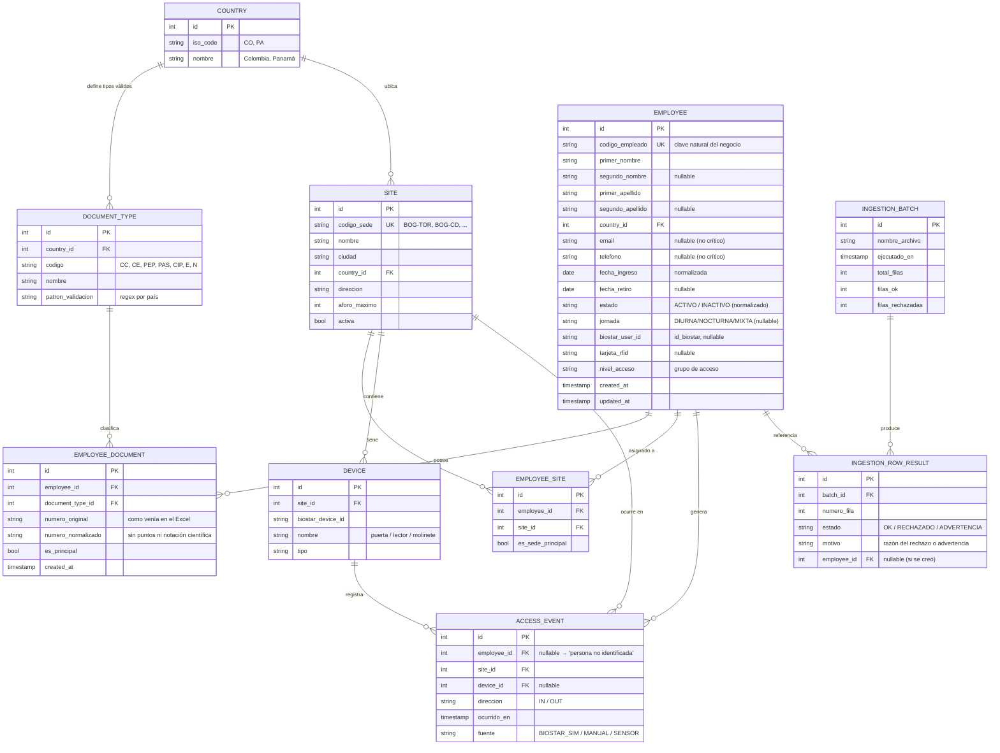
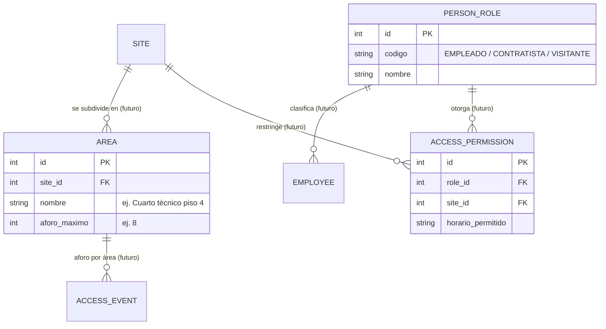

# Modelo de Datos (ERD) — Sistema de control de acceso Banco Andino

> Diagrama entidad-relación de la base PostgreSQL. Incluye el mapeo explícito de **qué campos del Excel se conservan, se transforman o se eliminan**, y por qué (requisito del enunciado). Los hallazgos de calidad de datos están medidos sobre el archivo real `03-empleados-banco-andino.xlsx` (150 filas de empleados, 6 sedes).

---

## 1. Decisiones de modelado clave

1. **Identidad del empleado desacoplada del documento.** La clave natural del negocio es **`codigo_empleado`**, que en el archivo real es **único (0 duplicados)** y estable. El documento pasa a ser un atributo en una tabla aparte. Esto resuelve C-04 y responde la pregunta P-02: sí hay un identificador interno confiable.
2. **Documento en tabla propia (`employee_document`), no como columnas del empleado.** Permite (a) unicidad compuesta `(document_type, número)` en vez de por número suelto, (b) tipos que dependen del país, y (c) que un empleado tenga **más de un documento vigente** (RF-05: trasladados con cédula CO + carné PA) sin rediseñar.
3. **Tipo de documento como catálogo ligado a país (`document_type`).** "CC" solo existe en Colombia; la cédula panameña, `E-`, `N-` solo en Panamá. Cada tipo lleva un patrón de validación. Se modela como dato, no como enum en código, para poder agregar tipos sin desplegar.
4. **Empleado ↔ sede muchos-a-muchos (`employee_site`).** No es excepción (RF-04). Se marca una sede primaria pero se admiten varias.
5. **Aforo calculado, no almacenado.** No hay tabla de "ocupación actual": se deriva de `access_event` (entradas sin salida). Evita estado duplicado que se desincroniza.
6. **Resumen de carga persistente (`ingestion_batch` + `ingestion_row_result`).** El resultado de cada carga se guarda para que Talento Humano consulte qué entró, qué no y por qué (RF-11).

---

## 2. Diagrama entidad-relación (núcleo MVP)

### Entidades planteadas pero NO construidas en el MVP (dejadas listas para agregar)

- **`AREA`** habilita el aforo por piso/área (RF-14): el cuarto técnico del piso 4 con máximo 8 personas. Con esto, `access_event` colgaría de un área, no solo de la sede.
- **`PERSON_ROLE` + `ACCESS_PERMISSION`** son la base para contratistas/visitantes y el esquema de permisos (RF-21, RF-22). Se dejan modeladas para que incorporarlas sea **agregar tablas, no rediseñar** las existentes.

---

## 3. Mapeo Excel → modelo (qué se conserva, transforma o elimina)

### Hoja `Empleados` (22 columnas → modelo)

| Columna Excel | Destino en el modelo | Acción | Justificación |
|---|---|---|---|
| `codigo_empleado` | `employee.codigo_empleado` (UK) | **Conservar** como clave natural | Único en el archivo; ancla de deduplicación (P-02). |
| `primer_nombre`, `segundo_nombre`, `primer_apellido`, `segundo_apellido` | `employee.*` | Conservar | Se mantienen separados (útil para reportes y BioStar). |
| `tipo_doc` | `employee_document.document_type_id` | **Transformar** | Se mapea a `document_type` normalizado (ver §4). |
| `numero_documento` | `employee_document.numero_original` + `numero_normalizado` | **Transformar** | Se limpia puntos y notación científica; se guarda también el original. |
| `pais` | `employee.country_id` + `country` | **Transformar** | Se normaliza (PA/PANAMA/Panama → Panamá). |
| `sede` | `employee_site` → `site` | **Transformar** | Se resuelve al catálogo; variantes de texto normalizadas (ver §4). |
| `area`, `cargo` | `employee.area`, `employee.cargo` | Conservar | Contexto organizacional útil; bajo costo. |
| `centro_costo` | — | **Eliminar** | Dato de nómina, no aporta al control de acceso (RF-12, decisión de Fernando). |
| `tipo_contrato` | — | **Eliminar** | Ídem nómina (RF-12). |
| `fecha_ingreso`, `fecha_retiro` | `employee.fecha_ingreso`, `fecha_retiro` | **Transformar** | Parseo de formatos mixtos a `DATE`. |
| `estado` | `employee.estado` | **Transformar** | Normalizado a `ACTIVO/INACTIVO`. |
| `email` | `employee.email` (nullable) | Conservar | No crítico: si falta, se carga con advertencia. |
| `telefono` | `employee.telefono` (nullable) | Conservar | No crítico (criterio de Yolanda). |
| `id_biostar` | `employee.biostar_user_id` | Conservar | Enlace con BioStar. |
| `tarjeta_rfid` | `employee.tarjeta_rfid` | Conservar | Credencial de acceso. |
| `nivel_acceso` | `employee.nivel_acceso` | **Transformar** | Normalizado; mapea a grupo de acceso de BioStar. |
| `jornada` | `employee.jornada` (nullable) | **Transformar** | Normalizado; `N/A` → null. |

**Campos añadidos que no existen en el Excel:** claves subrogadas (`id`), catálogos `country` y `document_type`, tablas puente `employee_site`, `access_event`, `device`, `ingestion_batch`, `ingestion_row_result`, `numero_normalizado`, banderas `es_principal`/`es_sede_principal`, y timestamps de auditoría (`created_at`, `updated_at`).

### Hoja `Sedes` (limpia) → tabla `site`

Las 6 sedes vienen bien formadas (`codigo_sede`, `nombre`, `ciudad`, `pais`, `direccion`, `aforo_maximo`, `activa`) y pueblan directamente `site`. `aforo_maximo` alimenta las alertas de sobreaforo; `activa` se convierte a booleano.

---

## 4. Hallazgos de calidad de datos (medidos sobre el archivo real)

Estos son los problemas reales que la ingesta debe manejar, con conteos:

- **`país` con 5 variantes:** `Colombia`, `Panamá`, `PA`, `PANAMA`, `Panama`, y 1 nulo → normalizar a 2 países.
- **`tipo_doc` inconsistente:** `CC` (111), `CIP` (28, cédula Panamá), `CE` (5), `PAS`/`PA` (pasaporte, escrito de 2 formas), `N` (naturalizado Panamá, 1), y **2 nulos**. Hay que mapear estos códigos a un catálogo único por país (nota: el archivo usa `CIP`, no aparece `PEP` pese a mencionarse en la reunión → **discrepancia a validar con el cliente**).
- **`estado` con 5 variantes:** `Activo`, `Inactivo`, `ACTIVO`, `A`, `Retirado`, 1 nulo → normalizar a `ACTIVO/INACTIVO`.
- **`sede` con valores fuera de catálogo:** además de las variantes de texto `BOGOTA` y `Bogotá D.C.`, aparece **`BAQ-01` (Barranquilla), una sede que NO existe en el catálogo de 6 sedes**, y valores nulos. → registros a marcar para revisión (¿sede nueva no informada, o error?).
- **`numero_documento` sucio:** valores con puntos (`1.020.304.050`) y en **notación científica** (`1.02E+09`, por Excel) → limpiar antes de comparar/deduplicar.
- **Duplicados por número:** 3 números repetidos (`52447891`, `79458122`, y `8-123-456` —el formato de ejemplo panameño—) con `codigo_empleado` distinto → candidatos a fusión/revisión (RF-09).
- **Fechas en 3 formatos de texto** conviviendo con fechas reales: `2022-11-03`, `15/03/2022`, `3 de abril de 2021`, más 1 nula → parseo tolerante.
- **Faltantes:** 2 sin documento y 2 sin tipo_doc → **rechazo** (crítico, RF-10); 1 sin email, 3 sin teléfono, 3 sin `id_biostar` → **carga con advertencia** (no crítico).
- Otros: `nivel_acceso`, `jornada`, `tipo_contrato` también traen nulos y mayúsculas inconsistentes.

Cada uno de estos casos genera una fila en `ingestion_row_result` con su `estado` y `motivo`, de modo que el resumen de carga sea accionable.

---

## 5. Cómo se conecta con el resto

- Cada entidad es propiedad de un **módulo** del backend (ver `ARQUITECTURA.md`): `employees` (EMPLOYEE, EMPLOYEE_DOCUMENT), `sites` (SITE, EMPLOYEE_SITE), `occupancy` (ACCESS_EVENT), `ingestion` (INGESTION_*), `biostar` (DEVICE).
- Las entidades futuras (`AREA`, `PERSON_ROLE`, `ACCESS_PERMISSION`) materializan la promesa del `ALCANCE.md`: extender el sistema es **agregar, no rediseñar**.
- Las transformaciones de §3 y §4 son la evidencia para la pregunta de sustentación *"qué hiciste con los datos con errores y por qué"*.
